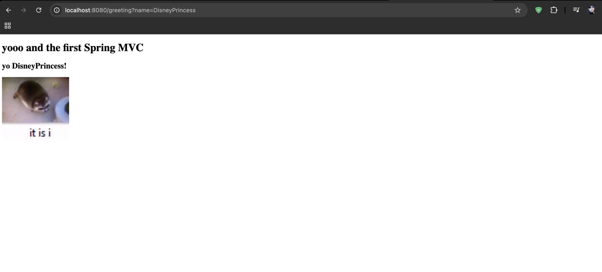

# Task 1 — Spring Boot 
One controller, one text endpoint, one Thymeleaf page.
---
## Technologies
- Java 17
- Maven
- Spring Boot
- Spring Web
- Thymeleaf
- Lombok

---

## How to Run
1. Open the project.
2. Run `DemoApplication`.or use `./mvnw spring-boot:run` on the root of the project 
3. App running under **http://localhost:8080**

---

# GET /
- Returns plain text.

# GET /greeting
- Returns an HTML page rendered by Thymeleaf, logo displayed at this page

## Usage / Use Case

The application displays a value passed via URL parameter.

### Example

Open in browser:

`http://localhost:8080/greeting?name=DisneyPrincess`

The value of the parameter is displayed on the Thymeleaf page.

## Finish